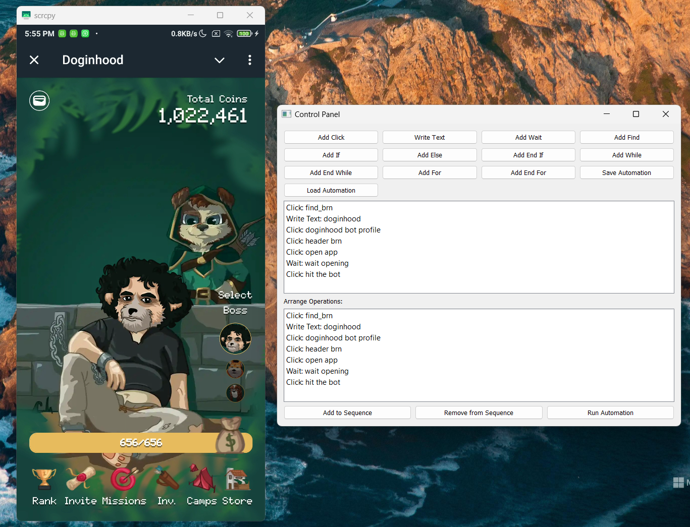

# Android Automation Tool

This project is an Android automation tool that allows users to create, save, and run automated sequences of actions on an Android device using the scrcpy screen mirroring software.

## 🚀 Features

- Create automated sequences of actions including clicks, text input, waits, and image recognition
- Save and load automation sequences
- Intuitive GUI for creating and managing automation steps
- Support for conditional statements (if/else) and loops (while/for)
- Integration with scrcpy for Android screen mirroring

## 📋 Prerequisites

- Python 3.7+
- PyQt5
- OpenCV (cv2)
- pyautogui
- keyboard
- numpy
- scrcpy (must be installed separately)

## 🛠️ Installation

1. Clone this repository:
   ```
   git clone https://github.com/Alperenclk/Advenced_tab_to_earn_automation_bot_for_android_phone
   cd android-automation-tool
   ```

2. Install the required Python packages:
   ```
   pip install PyQt5 opencv-python pyautogui keyboard numpy
   ```

## 📱 Usage

1. Connect your Android device to your computer via USB and enable USB debugging.

2. Run the application:
   ```
   python main.py
   ```

3. Use the GUI to create your automation sequence:
   - Add actions like clicks, text input, and waits
   - Use the "Find" action to add image recognition steps
   - Add control structures like if/else statements and loops

4. Save your automation sequence for later use.

5. Run the automation sequence by clicking the "Run Automation" button.

## 📸 Example of Application


## 🔗 Other Works

- [Tap-To-Earn Bot For Telegram](https://github.com/Alperenclk/Tap-To-Earn_Bot_For_Telegram)
- [Automating Telegram Game Bot Clicker with Python: Step-by-Step Guide](https://medium.com/@alperenclk/automating-telegram-game-bot-clicker-with-python-step-by-step-guide-1b9206188d06)

## 🎮 Doginhood Invite Code

Join the DinoHood mining game using these invitation links:

- **Regular Invitation**: [https://t.me/Doginhood_bot/dogin?startapp=027s7njc](https://t.me/Doginhood_bot/dogin?startapp=027s7njc)
- **Special Camping Code**: [https://t.me/Doginhood_bot/dogin?startapp=027s7njc_camp8w8lhQfD](https://t.me/Doginhood_bot/dogin?startapp=027s7njc_camp8w8lhQfD)

Use these codes to get started with the DinoHood mining game and enjoy special benefits!

## 🤝 Contributing

Contributions are welcome! Please feel free to submit a Pull Request.

## 📄 License

This project is licensed under the MIT License - see the [LICENSE](LICENSE) file for details.